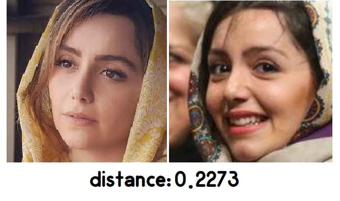
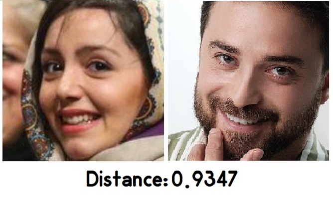

# Sima Face-Recognition

Sima is an Open-source Pytorch face Recognition project. It`s based on ResNet architecture and TripletLoss(This loss has been developed by google team).  
We use CASIA-WebFace and Sima Dataset for training and LFW dataset for validation.  

You can download pre-trained model(ResNet18) from [here](https://drive.google.com/file/d/1-6XeosHIyYkivi1UjJevl4oor1twVyQ7/view?usp=sharing). This model get 78% Accuracy on LFW dataset in verification mode and with 11.000.000 patameters.

My goal is to train ResNet34 and get better Accuracy on the LFW dataset. After that, I want to make a transfer learning for the Iranian Face dataset(Sima Dataset).  

## Deployment

Explain included files:

- ***main.py*** : Start training loop.  
- ***loss.py*** : Implemetation of triplet loss function.  
- ***resnet.py*** : Implemetation of ResNet 18 & 34 architecture.  
- ***utils.py*** : Some function.  

Explain Folders:

- ***[IranianFace-Dataset](https://github.com/mertz1999/Sima-Face-Recognition/tree/main/IranianFace-Dataset)*** : You can use nootbooks that are in this folder for making a dataset based on instagram id.  
- ***[LFW_Pairs](https://github.com/mertz1999/Sima-Face-Recognition/tree/main/LFW_Pairs)***: Making .npy list file for lfw pairs path

## Authors

- [Reza Tanakizadeh](https://github.com/mertz1999)

## License

[MIT](https://choosealicense.com/licenses/mit/)

## Feedback

If you have any feedback or need my dataset, please reach out to me at reza.tz780210@gmail.com

